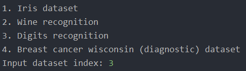
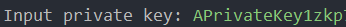
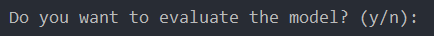
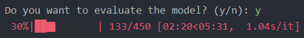
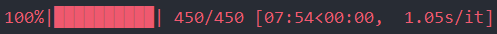
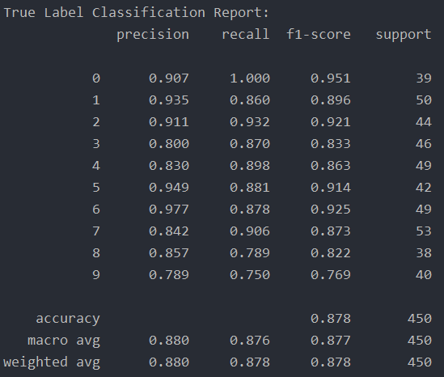
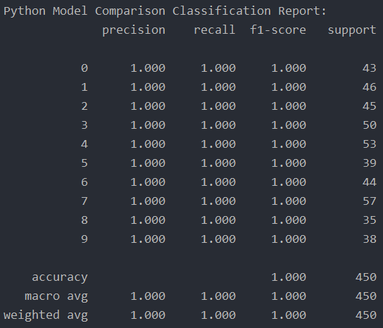

# 🌳 Python-Leo Decision Tree Classifier Transpiler 🚀

DISCORD: ollstar41

The program for transpiling decision tree models created using the scikit-learn library into Leo language code from the [Aleo](https://aleo.org/) project.

---

* [🛠 Installation](#-installation)
* [🧠 Technical Solutions Implemented in This Project](#-technical-solutions-implemented-in-this-project)
* [🔄 Workflow of the Program](#-workflow-of-the-program)
* [📝 Example of the Program's Work](#-example-of-the-programs-work)
* [📊 How Metrics Are Calculated](#-how-metrics-are-calculated)
* [📈 Model Performance Results](#-model-performance-results)
* [🔒 License](#-license)
* [📘 Theoretical Information on Decision Trees](#-theoretical-information-on-decision-trees)
* [📮 Contact Information](#-contact-information)

## 🛠 Installation
1. Install [Python 3.11](https://www.python.org/downloads/release/python-3116/)
2. Install the [Leo compiler](https://developer.aleo.org/leo/installation)
3. In the terminal, run the command `python3 -m pip install -r requirements.txt` to install all dependencies
4. Start the program using the command `python3 py_transpiler/main.py`

## 🧠 Technical Solutions Implemented in This Project
Leo language does not support more than 16 arguments for functions, however, some datasets may contain far more than 16 features, for example, the [Digits](https://scikit-learn.org/stable/auto_examples/datasets/plot_digits_last_image.html) dataset, which contains 64 features.
To address this issue, the following approach was used:

- First, the base 16 logarithm of the total number of features is calculated and rounded up.
- The resulting value is the number of groups into which our features must be grouped.
- If this value is greater than one, the function will work recursively, creating several levels of groups, each with 16 or fewer groups.

This logic is also retained when running the program with the `leo run predict` command and when filling in the `.in` file. 
Another problem is the absence of floating-point numbers in Leo language. To solve this issue, the following approach was used:

- After training on a dataset, a certain multiplier is set, which will be used to multiply all values.
- The program generates code using the `i128` type for maximum precision, and the maximum multiplier is `2^64` to avoid situations where we get overflow of the `i128` type in the test dataset.

This will not guarantee 100% accuracy of the model, but the indicator is still at a very high level.

## 🔄 Workflow of the Program
1. Immediately after launching, you will be prompted to select a dataset presented in the scikit-learn library for classification tasks: 
    - [Iris](https://scikit-learn.org/stable/modules/generated/sklearn.datasets.load_iris.html#sklearn.datasets.load_iris)
    - [Digits](https://scikit-learn.org/stable/modules/generated/sklearn.datasets.load_digits.html#sklearn.datasets.load_digits)
    - [Wine](https://scikit-learn.org/stable/modules/generated/sklearn.datasets.load_wine.html#sklearn.datasets.load_wine)
    - [Breast Cancer](https://scikit-learn.org/stable/modules/generated/sklearn.datasets.load_breast_cancer.html#sklearn.datasets.load_breast_cancer)
2. After selecting the data, the program will request to enter the private key from the Aleo wallet for the correct operation of Leo.
3. Then the model training on Python language begins with further translation into Leo code.
4. The next step, the program will ask if you need to evaluate the model. If you choose yes, the program will run a test dataset on Leo language and compare the results with those obtained using the model on Python language.
5. After checking the model, the program will display [classification reports](https://scikit-learn.org/stable/modules/generated/sklearn.metrics.classification_report.html):
    - The first will compare the results of the model in Leo language with the true values.
    - The second will compare the model in Python language with the model in Leo language: if accuracy is 1, then the models match.

## 📝 Example of the Program's Work
In this example, we will consider the most technically interesting dataset - [Digits](https://scikit-learn.org/stable/auto_examples/datasets/plot_digits_last_image.html), which contains 64 features and 10 classes.

1. A dataset selection dialog appears, we choose the third dataset. 

2. A field for entering the private key from the Aleo wallet appears. 

3. The model training starts in Python language (invisible to the user).
4. A dialog appears asking whether to evaluate the model. 

5. We select yes, the model is evaluated. 

6. Classification reports appear:
    - The classification report compared with the true values. 
   
    - The classification report compared with the model in Python language. 
   

## 📊 How Metrics Are Calculated
The following metrics are used in this project:
- Accuracy
- Precision
- Recall
- F1 score

First, the program runs the `leo run predict` command for each row in the test data set, gets a response, and records it. Then the [sklearn.metics.classification_report](https://scikit-learn.org/stable/modules/generated/sklearn.metrics.classification_report.html) function is given the true values and obtained responses, after which it returns all the metrics that we output to the console.
Then the same `classification_report` function is passed the previous responses of the model in Leo language and responses of the model in Python language, after which it returns all the metrics, which we also output to the console.

## 📈 Model Performance Results
The following table shows the results of the decision tree on Leo language for all mentioned datasets.

| Dataset        | Accuracy | Precision | Recall | F1 score |
|----------------|----------|-----------|--------|----------|
| Iris           | 0.868    | 0.887     | 0.868  | 0.869    |
| Wine           | 0.844    | 0.862     | 0.844  | 0.846    |
| Digits         | 0.878    | 0.880     | 0.878  | 0.878    |
| Breast cancer  | 0.930    | 0.929     | 0.930  | 0.930    |

The results are excellent, with all models in Leo language matching the models in Python language, confirming the program's correctness. It should be noted that the data was obtained during testing on a randomly selected part of the dataset, which is 25% of the total volume of data.

If you want to verify the model's work, please adapt the program code for this and create an Issue with the work results, which will be added to this table.

---

## 🔒 License
This project is distributed under the MIT License. See `LICENSE` for more information. The MIT License is a permissive license that is short and to the point. It lets people do anything they want with your code as long as they provide attribution back to you and don’t hold you liable.

## 📘 Theoretical Information on Decision Trees
Decision Trees are a type of Supervised Machine Learning where the data is continuously split according to a certain parameter. The tree can be explained by two entities, namely decision nodes and leaves. The leaves are the decisions or the final outcomes. And the decision nodes are where the data is split.

Here's a simple way to understand the mechanism of a Decision Tree:
- Start at the tree's root node as the parent node.
- Select the best feature using the Attribute Selection Measures(ASM) to split the records.
- Make that feature the decision node and break the dataset into smaller subsets.
- Starts tree building by repeating this process recursively for each child until one of the condition will match:
  - All the tuples belong to the same attribute value.
  - There are no more remaining attributes.
  - There are no more instances.

## 📮 Contact Information
For any inquiries or issues with the software, please open an issue in the GitHub repository. Additionally, contributions are always welcome! If you would like to contribute, please fork the repository and use a feature branch. Pull requests are warmly welcome.
